## GPS信号

https://zhuanlan.zhihu.com/p/562697339

https://zhuanlan.zhihu.com/p/106778915

卫星所发射的信号可分为三个层次：**载波(Carrier signal)、伪码(PRN code伪码中的一种)和数据码(Navigation message)**。在这三个层次中，伪码和数据码一起先通过调制依附在正弦波形式上的载波，然后卫星将调制后的载波信号发射出去。因此，载波可以说是卫星信号中的最底层。

## 相关坐标系

### 地球坐标系

虽然惯性坐标系中描述卫星运行轨道相当方便，但是因为惯性坐标系和地球自转无关，所以地球上任一固定点在惯性坐标系中的坐标会随着地球的自转而时刻改变，所以惯性坐标系用来描述地球上固定的一点是非常不方便的。地球坐标系固定在地球上，随着地球的运动而运动，所以又称为地固坐标系。

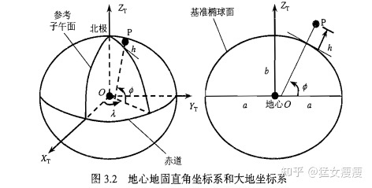

地心直角坐标系(Xt,Yt,Zt)和大地坐标系(phi,lambda,h)均是以地心O为坐标原点的地球坐标系，所以两者又称为地心地固坐标系(ECEF:Earth Centered Earth Fixed)。

假设点P在大地坐标系中的坐标记为(phi,lambda,h)，那么：

大地纬度phi是通过点P的基准椭球面法线和赤道面（地心直角坐标系的X-Y平面）之间的夹角。纬度范围在-90度到90度之间，赤道面以北为正，以南为负，例如phi = 30度就是指南纬30度。

大地经度lambda是经过点P的子午面与格林的参考子午面之间的夹角。经度lambda的范围在-180度到180之间，或者是0到360度之间。参考子午面以东为正，以西为负。

大地高度h是指点P到基准椭球面的法线距离。基准椭球面以外为正，以内为负。

### 站心坐标系

**站心坐标系通常以用户所在位置点P作为原点，三个坐标轴分别是相互垂直的东向、北向和天向，所以站心坐标系通常又称为东北天(ENU)坐标系**。

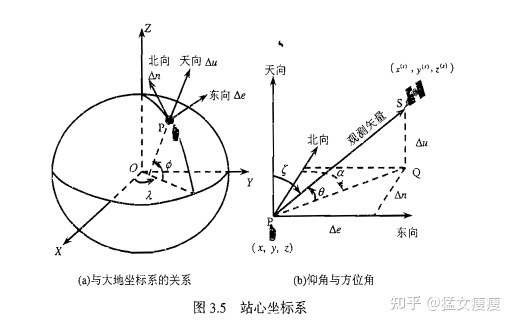

设用户坐标点P在地心地固直角坐标系中的坐标为(x,y,z)，某卫星位置点S的坐标为(xs,ys,zs),那么:

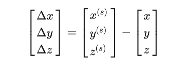

观测向量[deltax,deltay,deltaz].transe可等效地表达在以点P为原点的站心坐标系中的向量[deltae,deltan,deltau]T，其变换关系：

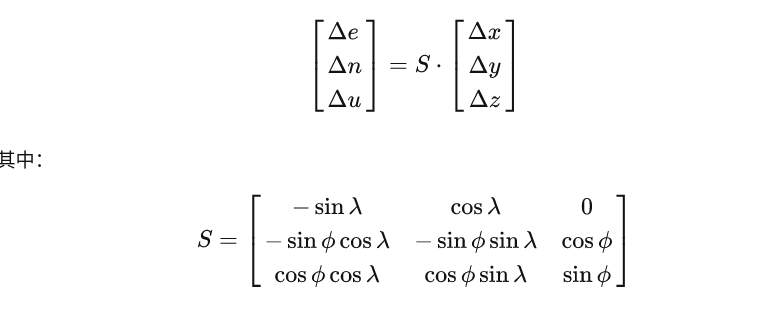

## GPS测量及其误差  

### 伪距测量值

伪距测量值是GPS接收机对卫星信号的一个最基本的测量值。测量多颗可见卫星的伪距是GPS接收机实现单点绝对定位的必要条件。

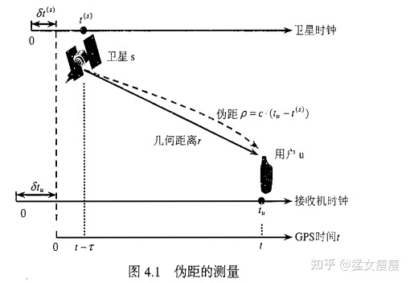

某卫星s按照其自备的卫星时钟在t(s)时刻发射出某一信号，将这个时刻称之为GPS信号的发射时间。该信号在tu时刻被用户的GPS接收到，将tu称作是GPS信号的接收时间，是从接收机的时钟上读出来的。那么主要涉及GPS时间、卫星时钟和接收机时钟三种时间。用户接收机时钟产生的时间通常与GPS时间不同步。假设对应与信号接收时间tu记为tu(t)，并将此时的接收机时钟超前的量记为deltatu(t)，那么： 

 **deltatu(t)通常称为接收机时钟钟差，大概率是未知的**，并且是一个关于GPS时间t的函数。

各个卫星时钟也不可能与GPS时间严格同步，所以GPS的发射时间也存在时钟钟差deltat(s)(t)，但是卫星时钟校正参数求得此时钟钟差，所以deltat(s)(t)是已知的.

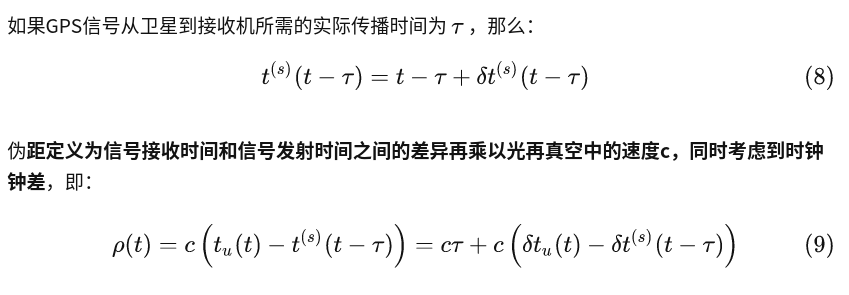

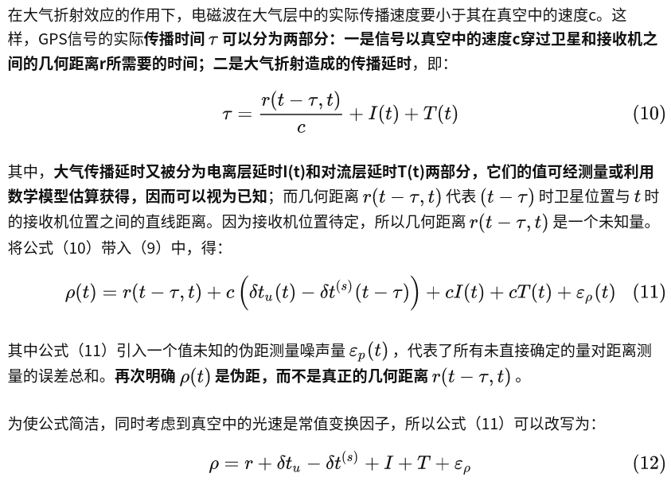

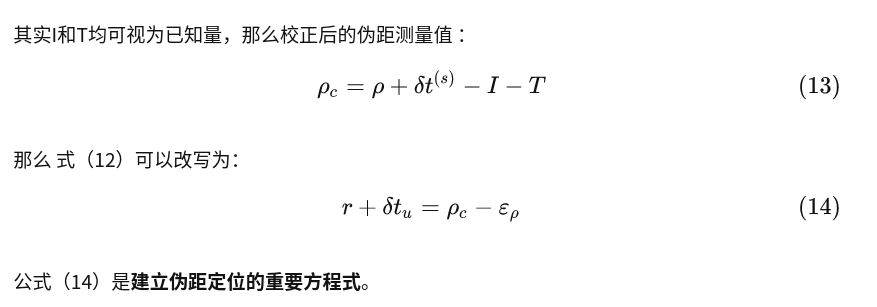

### 载波相位测量值

除了伪距之外，GPS接收机从卫星信号中获得的另一个基本测量值是载波相位，它在分米级、厘米级的GPS精密定位中起着关键性作用。

假设接收机和卫星之间保持相对静止，并且两者的时钟又完全同步、同相，那么再任何时刻接收机的复制载波信号相位就等于实际的卫星载波信号在卫星端的相位。若接收机在采样时刻tu接受内部复制的载波相位为phiu，而接收机接受、测量到的卫星载波信号为phi(s)，则载波相位测量值  定义为结合搜集复制载波信号的相位和接收机收到的卫星载波信号的相位之间的差异，即

**再次强调，载波相位测量值实际上值的是载波相位差，只有载波相位差或者说只有载波相位变化量才包含距离信息，仅在某一点某一时刻的载波相位通常不能说明任何问题。在不引起混淆的情况下，总是将这种载波相位差简称为载波相位，这是需要注意的**。

### 多普勒频移

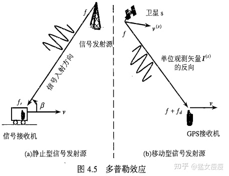

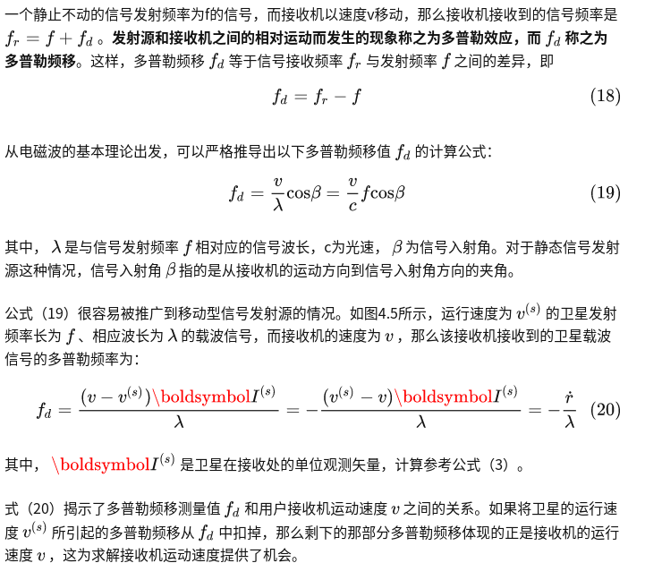

## GPS定位

### 伪距定位

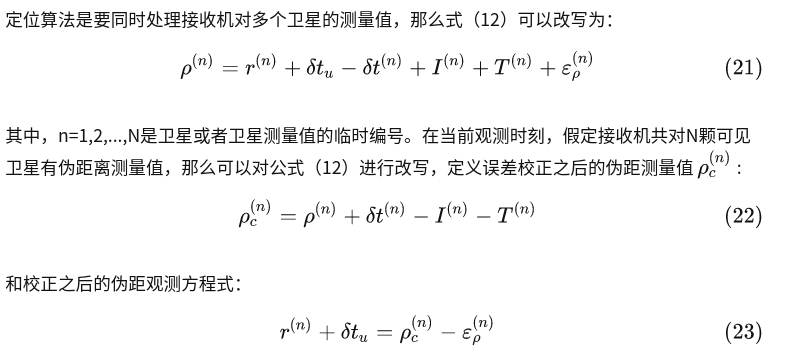

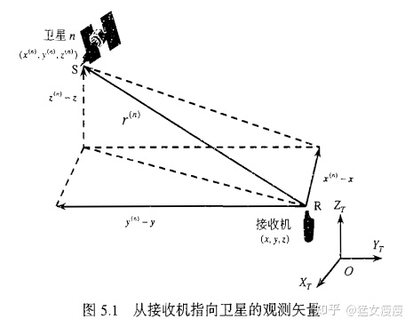

### 差分定位DGPS

## 定位精度分析

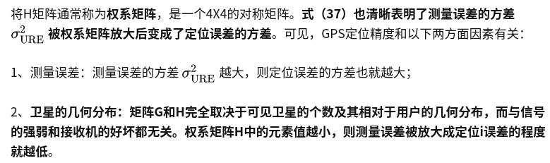

### 精度因子（DOP）

### 使用

无人车的基于地图匹配定位的这一个部分中，GNSS经常用来提供初始化。就目前来看，GNSS的定位方式主要包括单点定位(SPP)，也就是我们手机常用的单点定位方式；RTK定位和DGNSS定位。对于一个接收机所收到的数据，主要包括载波（carrier-phase），伪距（code）和导航数据（navigation data）。GPS定位的主要误差源及其误差范围如下：

- **电离层误差**：0~30 米，由于电离层对GPS信号的干扰，在不同的电离层情况下，误差在一定范围内波动。
- **对流层误差**：0~30 米，由于对流层对GPS信号的干扰，在不同的对流层情况下，误差在一定范围内波动。
- **卫星时钟误差**：0~3米，也叫satellite clock bias。
- **接收时钟误差**：0~10米，也叫receiver clock bias。
- **多路径和非视距信号**（multipath/NLOS）：0~100米。

**单点定位（Single Point Positioning）**: 单点定位是基于接收机收到的卫星伪距（距离）信息，计算接收机的绝对位置。在空旷区域下，精度可达3~10米。

**差分GPS定位**：当前流行的差分GPS定位主要原理是通过接收基站的数据，对伪距进行差分，可有效的消除电离层误差，对流层误差，卫星时钟误差和接收机时钟误差。但是由于只采用伪距，且伪距的精度有限，定位精度大约在0.5~2米之间。

**RTK GPS定位**：RTK GPS定位技术是当前自动驾驶领域广泛应用的高精度定位技术。和差分GPS定位相比较，RTK也是有赖于来自基站的观测数据，可有效的消除电离层误差，对流层误差，卫星时钟误差和接收机时钟误差；RTK同时采用了载波观测量进行位置解算。本篇主要介绍如何解算**RTK GPS**定位。从伪距，**载波的观测量建模**开始，到基于**Ceres Solver的非线性优化求解float解**，然后采用流行的**LAMBDA算法求解模糊度（ambiguity）**。

