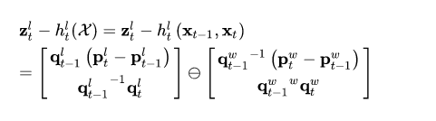
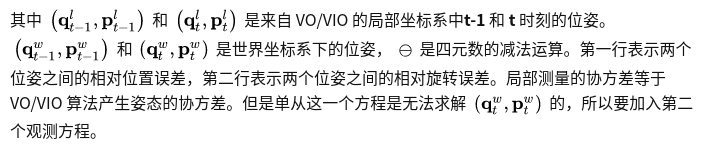
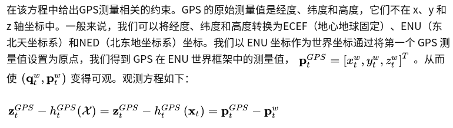
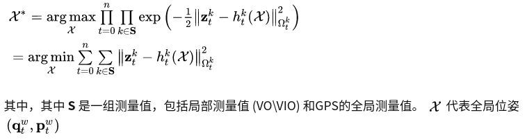
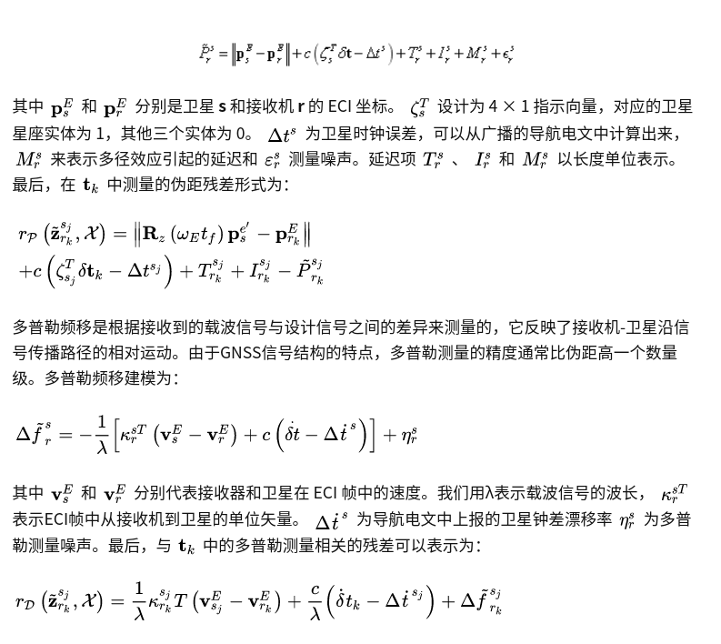

## GNSS在多传感器融合定位中的两种建模方法

### 直接观测

直接利用GNSS输出的位置信息，与局部定位算法输出的局部轨迹进行对齐，其观测方程







GPS 测量直接约束每个节点的位置。协方差由接收测量时的卫星数量决定。它接收的卫星越多，它的协方差就越小。

在图优化的理论中，观测方程可以转化为残差。即全局状态估计问题转化为以下的非线性最小二乘问题：



```c++
    map<double, vector<double>> localPoseMap;// vio 的位姿
    map<double, vector<double>> globalPoseMap; // WGPS_T_WVIO 将 vio转换到global，优化变量
    map<double, vector<double>> GPSPositionMap; // GPS位置
```

### example  VINS-Fusion

```c++
#pragma once
// https://blog.csdn.net/hltt3838/article/details/119776801
// https://www.cnblogs.com/gooutlook/p/17026445.html
#include <ceres/ceres.h>
#include <ceres/rotation.h>

namespace vision_localization {

template <typename T>
inline void QuaternionInverse(const T q[4], T q_inverse[4]) {
    q_inverse[0] = q[0];
    q_inverse[1] = -q[1];
    q_inverse[2] = -q[2];
    q_inverse[3] = -q[3];
};

struct RelativeRTError {
  public:
    RelativeRTError(double t_x, double t_y, double t_z, double q_w, double q_x,
                    double q_y, double q_z, double t_var, double q_var)
        : t_x_(t_x), t_y_(t_y), t_z_(t_z), q_w_(q_w), q_x_(q_x), q_y_(q_y),
          q_z_(q_z), t_var_(t_var), q_var_(q_var) {}
    RelativeRTError(const Eigen::Vector3d &t, const Eigen::Quaterniond &q,
                    double t_var, double q_var)
        : t_x_(t.x()), t_y_(t.y()), t_z_(t.z()), q_w_(q.w()), q_x_(q.x()),
          q_y_(q.y()), q_z_(q.z()), t_var_(t_var), q_var_(q_var) {}

    template <typename T>
    bool operator()(const T *const w_q_i, const T *const ti,
                    const T *const w_q_j, const T *const tj,
                    T *residuals) const {
        T t_w_ij[3];
        t_w_ij[0] = tj[0] - ti[0];
        t_w_ij[1] = tj[1] - ti[1];
        t_w_ij[2] = tj[2] - ti[2];

        T i_q_w[4];
        QuaternionInverse(w_q_i, i_q_w);

        T t_i_ij[3];
        ceres::QuaternionRotatePoint(i_q_w, t_w_ij, t_i_ij);

        residuals[0] = (t_i_ij[0] - T(t_x_)) / T(t_var_);
        residuals[1] = (t_i_ij[1] - T(t_y_)) / T(t_var_);
        residuals[2] = (t_i_ij[2] - T(t_z_)) / T(t_var_);

        T relative_q[4];
        relative_q[0] = T(q_w_);
        relative_q[1] = T(q_x_);
        relative_q[2] = T(q_y_);
        relative_q[3] = T(q_z_);

        T q_i_j[4];
        ceres::QuaternionProduct(i_q_w, w_q_j, q_i_j);

        T relative_q_inv[4];
        QuaternionInverse(relative_q, relative_q_inv);

        T error_q[4];
        ceres::QuaternionProduct(relative_q_inv, q_i_j, error_q);

        residuals[3] = T(2) * error_q[1] / T(q_var_);
        residuals[4] = T(2) * error_q[2] / T(q_var_);
        residuals[5] = T(2) * error_q[3] / T(q_var_);

        return true;
    }

    static ceres::CostFunction *Create(const double t_x, const double t_y,
                                       const double t_z, const double q_w,
                                       const double q_x, const double q_y,
                                       const double q_z, const double t_var,
                                       const double q_var) {
        return (new ceres::AutoDiffCostFunction<RelativeRTError, 6, 4, 3, 4, 3>(
            new RelativeRTError(t_x, t_y, t_z, q_w, q_x, q_y, q_z, t_var,
                                q_var)));
    }

    static ceres::CostFunction *Create(const Eigen::Vector3d t,
                                       const Eigen::Quaterniond q,
                                       const double t_var, const double q_var) {
        return (new ceres::AutoDiffCostFunction<RelativeRTError, 6, 4, 3, 4, 3>(
            new RelativeRTError(t, q, t_var, q_var)));
    }

    double t_x_, t_y_, t_z_, t_norm_;
    double q_w_, q_x_, q_y_, q_z_;
    double t_var_, q_var_;
};

struct TError {
    //输入观测量
    TError(double t_x, double t_y, double t_z, double var)
        : t_x_(t_x), t_y_(t_y), t_z_(t_z), var_(var) {}
	
    // 待优化输出的tj量 
    template <typename T>
    bool operator()(const T *const tj, T *residual) const {
        //残差= (待优化tj-观测量t_x)/var gps的准确度方差
        residual[0] = (tj[0] - T(t_x_)) / T(var_);
        residual[1] = (tj[1] - T(t_y_)) / T(var_);
        residual[2] = (tj[2] - T(t_z_)) / T(var_);

        return true;
    }

    static ceres::CostFunction *Create(const double t_x, const double t_y,
                                       const double t_z, const double var) {
        return (new ceres::AutoDiffCostFunction<TError, 3, 3>(
            new TError(t_x, t_y, t_z, var)));
    }

    double t_x_, t_y_, t_z_, var_;
};

} // namespace vision_localization
```


```c++
void GlobalOptimization::optimize()
{
    while(true)
    {
        if(newGPS)
        {
            newGPS = false;
            printf("global optimization\n");
            TicToc globalOptimizationTime;

            ceres::Problem problem;
            ceres::Solver::Options options;
            options.linear_solver_type = ceres::SPARSE_NORMAL_CHOLESKY;
            //options.minimizer_progress_to_stdout = true;
            //options.max_solver_time_in_seconds = SOLVER_TIME * 3;
            options.max_num_iterations = 5;
            ceres::Solver::Summary summary;
            ceres::LossFunction *loss_function;
            loss_function = new ceres::HuberLoss(1.0);
            ceres::LocalParameterization* local_parameterization = new ceres::QuaternionParameterization();

            //add param
            mPoseMap.lock();
            int length = localPoseMap.size();
            // vio 的位姿没有转换到gps下
            double t_array[length][3];
            double q_array[length][4];
            map<double, vector<double>>::iterator iter;
            iter = globalPoseMap.begin();//优化变量
            for (int i = 0; i < length; i++, iter++)
            {
                t_array[i][0] = iter->second[0];
                t_array[i][1] = iter->second[1];
                t_array[i][2] = iter->second[2];
                q_array[i][0] = iter->second[3];
                q_array[i][1] = iter->second[4];
                q_array[i][2] = iter->second[5];
                q_array[i][3] = iter->second[6];
                // 代优化变量
                problem.AddParameterBlock(q_array[i], 4, local_parameterization);
                problem.AddParameterBlock(t_array[i], 3);
            }

            map<double, vector<double>>::iterator iterVIO, iterVIONext, iterGPS;
            int i = 0;
            for (iterVIO = localPoseMap.begin(); iterVIO != localPoseMap.end(); iterVIO++, i++)
            {
                //vio factor
                iterVIONext = iterVIO;
                iterVIONext++;
                if(iterVIONext != localPoseMap.end())
                {
                    Eigen::Matrix4d wTi = Eigen::Matrix4d::Identity();
                    Eigen::Matrix4d wTj = Eigen::Matrix4d::Identity();
                    wTi.block<3, 3>(0, 0) = Eigen::Quaterniond(iterVIO->second[3], iterVIO->second[4], 
                                                               iterVIO->second[5], iterVIO->second[6]).toRotationMatrix();
                    wTi.block<3, 1>(0, 3) = Eigen::Vector3d(iterVIO->second[0], iterVIO->second[1], iterVIO->second[2]);
                    wTj.block<3, 3>(0, 0) = Eigen::Quaterniond(iterVIONext->second[3], iterVIONext->second[4], 
                                                               iterVIONext->second[5], iterVIONext->second[6]).toRotationMatrix();
                    wTj.block<3, 1>(0, 3) = Eigen::Vector3d(iterVIONext->second[0], iterVIONext->second[1], iterVIONext->second[2]);
                    Eigen::Matrix4d iTj = wTi.inverse() * wTj;
                    Eigen::Quaterniond iQj;
                    iQj = iTj.block<3, 3>(0, 0);
                    Eigen::Vector3d iPj = iTj.block<3, 1>(0, 3);
					
                    // 观测量globalPose下的 Tij
                    ceres::CostFunction* vio_function = RelativeRTError::Create(iPj.x(), iPj.y(), iPj.z(),
                                                                                iQj.w(), iQj.x(), iQj.y(), iQj.z(),
                                                                                0.1, 0.01);
                   // 待优化量localPose下的Twi，Twj，输出量q_array
                    problem.AddResidualBlock(vio_function, NULL, q_array[i], t_array[i], q_array[i+1], t_array[i+1]);

                    /*
                    double **para = new double *[4];
                    para[0] = q_array[i];
                    para[1] = t_array[i];
                    para[3] = q_array[i+1];
                    para[4] = t_array[i+1];

                    double *tmp_r = new double[6];
                    double **jaco = new double *[4];
                    jaco[0] = new double[6 * 4];
                    jaco[1] = new double[6 * 3];
                    jaco[2] = new double[6 * 4];
                    jaco[3] = new double[6 * 3];
                    vio_function->Evaluate(para, tmp_r, jaco);

                    std::cout << Eigen::Map<Eigen::Matrix<double, 6, 1>>(tmp_r).transpose() << std::endl
                        << std::endl;
                    std::cout << Eigen::Map<Eigen::Matrix<double, 6, 4, Eigen::RowMajor>>(jaco[0]) << std::endl
                        << std::endl;
                    std::cout << Eigen::Map<Eigen::Matrix<double, 6, 3, Eigen::RowMajor>>(jaco[1]) << std::endl
                        << std::endl;
                    std::cout << Eigen::Map<Eigen::Matrix<double, 6, 4, Eigen::RowMajor>>(jaco[2]) << std::endl
                        << std::endl;
                    std::cout << Eigen::Map<Eigen::Matrix<double, 6, 3, Eigen::RowMajor>>(jaco[3]) << std::endl
                        << std::endl;
                    */

                }
                //gps factor
                double t = iterVIO->first;
                iterGPS = GPSPositionMap.find(t);
                if (iterGPS != GPSPositionMap.end())
                {
                    //输入观测量
                    ceres::CostFunction* gps_function = TError::Create(iterGPS->second[0], iterGPS->second[1], 
                                                                       iterGPS->second[2], iterGPS->second[3]);
                    //printf("inverse weight %f \n", iterGPS->second[3]);
                    //t_array 待优化参数
                    problem.AddResidualBlock(gps_function, loss_function, t_array[i]);

                    /*
                    double **para = new double *[1];
                    para[0] = t_array[i];

                    double *tmp_r = new double[3];
                    double **jaco = new double *[1];
                    jaco[0] = new double[3 * 3];
                    gps_function->Evaluate(para, tmp_r, jaco);

                    std::cout << Eigen::Map<Eigen::Matrix<double, 3, 1>>(tmp_r).transpose() << std::endl
                        << std::endl;
                    std::cout << Eigen::Map<Eigen::Matrix<double, 3, 3, Eigen::RowMajor>>(jaco[0]) << std::endl
                        << std::endl;
                    */
                }

            }
            //mPoseMap.unlock();
            ceres::Solve(options, &problem, &summary);
            //std::cout << summary.BriefReport() << "\n";

            // update global pose
            //mPoseMap.lock();
            iter = globalPoseMap.begin();
            for (int i = 0; i < length; i++, iter++)
            {
            	vector<double> globalPose{t_array[i][0], t_array[i][1], t_array[i][2],
            							  q_array[i][0], q_array[i][1], q_array[i][2], q_array[i][3]};
            	iter->second = globalPose;
            	if(i == length - 1)
            	{
            	    Eigen::Matrix4d WVIO_T_body = Eigen::Matrix4d::Identity(); 
            	    Eigen::Matrix4d WGPS_T_body = Eigen::Matrix4d::Identity();
            	    double t = iter->first;
            	    WVIO_T_body.block<3, 3>(0, 0) = Eigen::Quaterniond(localPoseMap[t][3], localPoseMap[t][4], 
            	                                                       localPoseMap[t][5], localPoseMap[t][6]).toRotationMatrix();
            	    WVIO_T_body.block<3, 1>(0, 3) = Eigen::Vector3d(localPoseMap[t][0], localPoseMap[t][1], localPoseMap[t][2]);
            	    WGPS_T_body.block<3, 3>(0, 0) = Eigen::Quaterniond(globalPose[3], globalPose[4], 
            	                                                        globalPose[5], globalPose[6]).toRotationMatrix();
            	    WGPS_T_body.block<3, 1>(0, 3) = Eigen::Vector3d(globalPose[0], globalPose[1], globalPose[2]);
            	    WGPS_T_WVIO = WGPS_T_body * WVIO_T_body.inverse();
            	}
            }
            updateGlobalPath();
            //printf("global time %f \n", globalOptimizationTime.toc());
            mPoseMap.unlock();
        }
        std::chrono::milliseconds dura(2000);
        std::this_thread::sleep_for(dura);
    }
	return;
}
```


### 降级观测  

使用GNSS的原始测量：伪距和多普勒频移。**伪距**的意思是GPS观测站到卫星的距离，由于尚未对因“卫星时钟与接收机时钟同步误差”的影响加以改正，在所测距离中包含着时钟误差因素在内，故称“伪距”。与上一种方法相比，这种建模方法与相机、IMU等传感器的融合更紧密。在跟踪卫星数量低于 4 的情况下，GPS位置输出不可靠的情况下，该方法仍然可以稳定输出。

接收到GNSS信号后，根据 **PRN** 码移测量信号的飞行时间 (ToF)。通过乘以光速**c**，接收器获得伪距测量。它不仅包含卫星与接收机之间的几何距离，还包含信号产生、传播和处理过程中的各种误差。伪距测量可以建模为：



**直接观测采用松耦合的方式加入GPS观测，而降级观测采用紧耦合的方式从传感器数据层面进行融合。**相比来说，降级观测模型更复杂，考虑了更多的参数和约束（伪距约束和多普勒约束），因此能实现精度更高、更鲁棒的系统。

从优化算法的层面来讲，两种方法是松耦合和紧耦合的区别，直接观测从位姿图优化的角度出发，降级观测从传感器因子图优化的角度出发。都能获得全局一致估计。值得说明的是，两种都需要严格的时间对准。因为基于卫星的定位都对时间同步要求非常严格。


https://www.zhihu.com/tardis/bd/art/481512585?source_id=1001